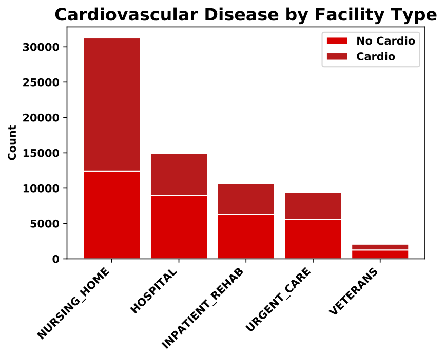
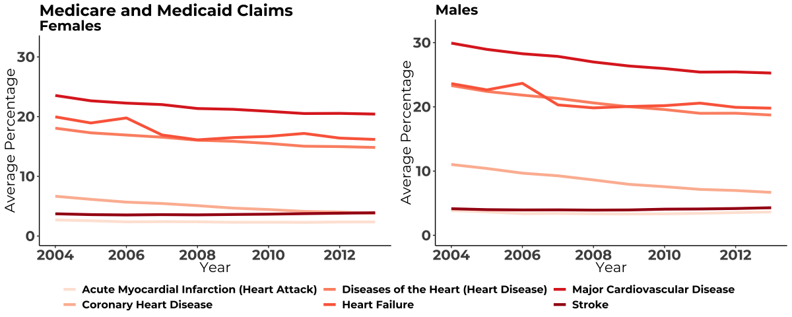
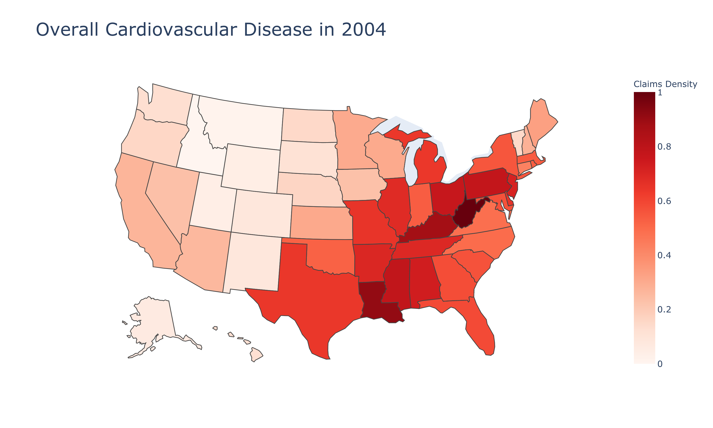
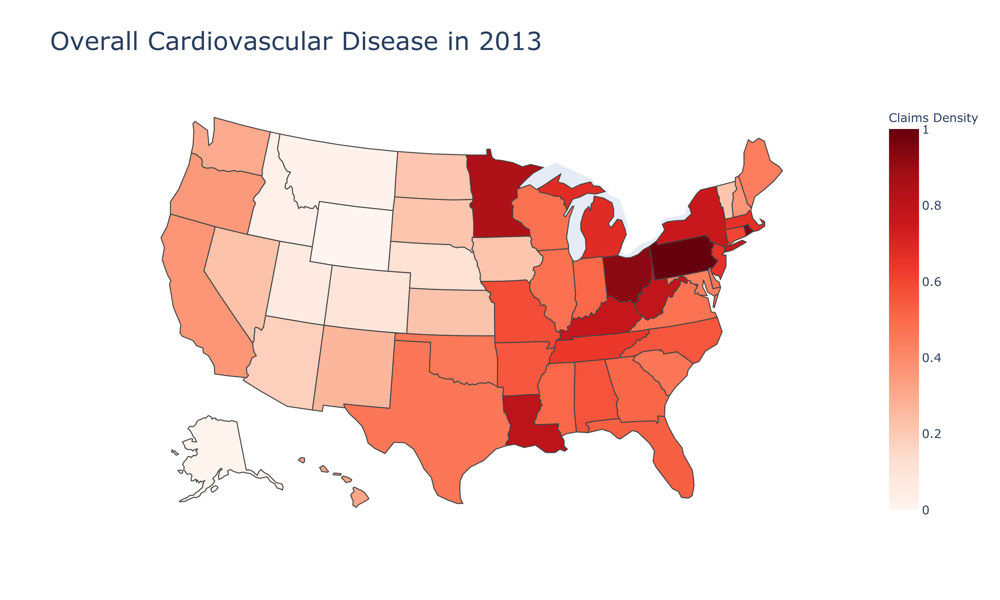

## Capstone

This was a team effort to create a final project that demonstrates mastery of previous course goals and apply in developing a practical solution and implementation plan. The topic 
selected by my group was cardiovascular disease. We utilized a data set available from [Kaggle]( https://www.kaggle.com/sulianova/cardiovascular-disease-dataset) that contained 70,000 records with 12 attributes: (1) age; (2) height; (3) weight; (4) gender; (5) systolic blood pressure; (6) diastolic blood pressure; (7) cholesterol; 
(8) glucose; (9) smoking; (10) alcohol intake; (11) physical activity; (12) presence or absence of cardiovascular disease.

### Predictive Modeling

I was the primary programmer on the project. The dataset was used to create models to predict the presence or absence of cardiovascular disease. Models were created in Python. I 
utilized the following algorithms: 
1. Logistic Regression, evaluated with thresholds set to 0.45 and 0.50
2. Random Forests
3. Neural Network
4. Gradient Boosting
5. XGBoost

Models were assessed for accuracy, classification error, sensitivity, specificity, false positive rate, precision, F1 score, and AUC. The neural network was assessed by accuracy 
and loss.

The XGBoost model resulted in the most accurate model. XGBoost is an ensemble method utilizing decision-trees combined with regularization to prevent overfitting. While it 
resulted in fewer true negatives as compared to logistic regression, random forest and gradient boosting, it resulted in more true positives with respect towards predicting 
cardiovascular disease. This model also resulted in the highest AUC score, which is a reflection of how well a model classifies data.

### Cluster Analysis

A clustering algorithm in R was used to try to identify trends among the patient records in the cardiovascular dataset. A mix of numerical and categorical variables from patients 
identified with cardiovascular disease was used to create profiles highlighting the most prominent patient features. An optimal segmentation of data points was obtained when the 
algorithm was specified to separate patients into six separate clusters. This segmentation approach created a balanced grouping of patients with respect to age and blood pressure, 
although trends were observed with cholesterol and glucose health and categorical indicators of smoking, alcohol intake, and physical activity.

The segments indicated that patients may make all the right choices towards a healthy lifestyle and yet still be diagnosed with cardiovascular disease. This revealed that there 
are additional variables not specified within the data set that determine a patient's predilection for cardiovascular disease, including genetic factors.

The cluster analysis allowed my teammates to create a suite of dashboards in Tableau based on the segmentations. A patient with cardiovascular disease could adjust the filters on 
the dashboard and be offered a customized program designed to reduce their risk.

### Facility Type Analysis

The dataset from Kaggle was modified by a team member so that each patient record reflected a facility type (nursing home, hospital, inpatient rehabilitation center, urgent care, 
veteran facility). An analysis on cardiovascular disease by facility type was conducted. 

By evaluating the facility location of patients, the stage of cardiovascular disease can be generalized, and programming efforts may be adjusted. Patients at nursing homes may 
have early or late stage cardiovascular disease, either pre- or post-cardiovascular event, but are generally not under an immediate disease event such as heart attack or stroke. 
Daily residential care is provided for patients by nursing aides and skilled nurses that allows for the monitoring of medication compliance. Medication may be adjusted for factors 
that contribute to cardiovascular disease such as blood pressure and cholesterol. These patients may receive targeted exercise and diet restrictions based upon mobility, physical 
therapy and/or weight. 

Patients in hospitals or urgent care centers are generally under an immediate event such as heart attack or stroke, or recently following a life-threatening event. Programming at 
these facilities would focus on educating a patient on what has physically occurred, treatment options, and introduction to support groups such as the American Heart Association 
and Million Hearts.

Patients at inpatient rehabilitation centers are receiving focused rehabilitative therapy as a result of a significant cardiovascular disease incident. The duration of stay is 
dependent upon patient needs, and treatment is completed by a physician-led multidisciplinary team.  Programming at these facilities would be similar to that received in hospitals 
and urgent care centers with an emphasis on habit-forming transformative changes to manage or reduce factors that contribute towards cardiovascular disease.

### Medicare and Medicaid Claims

Claims data from 2004 through 2013 for Medicare and Medicaid patients was analyzed by gender.

- On average, there are higher rates of heart disease for men compared to women.

The density of claims can be viewed nationally, and it can be observed that the location of cardiovascular disease claims changes over time. In order to do this, the data was 
first normalized by year as the total number of claims varies over time.

- In 2004, the incidence of claims was lower in the Western states, but higher is the Southern and Eastern states. The highest density of claims occurred in West Virginia, followed 
by Louisiana and Kentucky.

- In 2013, the incidence of claims continued to be lower in the Western states, but overall there were decreases in claims in the South and East. The highest density of claims 
had shifted to Pennsylvania, followed by Rhode Island and Ohio. While the density of cardiovascular disease claims decreased slightly in Louisiana, Minnesota had a dramatically 
higher rate of incidence. 

