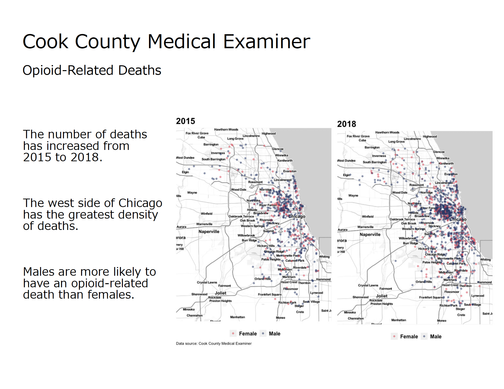

```R
# Jennifer Wanat, Assignment 5
# MSDS 455

# install and load needed packages
install.packages('plyr')
install.packages('tidyverse')
install.packages('networkD3')
install.packages('dplyr')
install.packages('caret')
install.packages('ggmap')

library(tidyverse)
library(plyr)
library(networkD3)
library(dplyr)
library(caret)
library(ggmap)
library(RColorBrewer)
library(gridExtra)

# set working directory
setwd("~/Desktop/R/")

##################################
# Medical Examiner Case Archive
##################################

# Data source
# https://datacatalog.cookcountyil.gov/Public-Safety/Medical-Examiner-Case-Archive/cjeq-bs86

# load data set for Cook County Medical Examiner
# source data in csv file
# if there are any blank entries, then replace with NA
me_cases <- read.csv("Medical_Examiner_Case_Archive.csv", header=T, na.strings=c("","NA"))
# examine the first five rows of the data set
head(me_cases)
summary(me_cases)
str(me_cases)

#convert date of death column from string to date
me_cases$FixedDate <- as.Date(me_cases$Date.of.Death,format="%m/%d/%Y")


# check frequency counts of opioid related deaths
opioid_count = count(me_cases, 'Opioid.Related')
opioid_count

#output
#Opioid.Related  freq
#1          false 26791
#2           true  5078


# create new dataframe of me_cases by gender, opioid.related, longitude, latitude
gender_opioid <- ddply(me_cases, .(me_cases$Gender, me_cases$Opioid.Related, me_cases$longitude, me_cases$latitude), nrow)
# check results
summary(gender_opioid)
str(gender_opioid)

#renaming the columns in the dataframe
names(gender_opioid) <- c('Gender', 'Opioid', 'longitude', 'latitude', 'value')


#let's look at only opioid deaths equal to true
# create new dataframe 
gender_opioid_only <- subset(gender_opioid, Opioid %in% c('true'))
# removing the NA's from the dataframe
gender_opioid_only <- na.omit(gender_opioid_only)
# checking the results
summary(gender_opioid_only)


#######################################


#https://statisticaloddsandends.wordpress.com/2018/10/25/getting-started-stamen-maps-with-ggmap/
#set map boundaries based on data
height <- max(gender_opioid_only$latitude) - min(gender_opioid_only$latitude)
width <- max(gender_opioid_only$longitude) - min(gender_opioid_only$longitude)
chi_borders <- c(bottom  = min(gender_opioid_only$latitude)  - 0.1 * height,
                 top     = max(gender_opioid_only$latitude)  + 0.1 * height,
                 left    = min(gender_opioid_only$longitude) - 0.1 * width,
                 right   = max(gender_opioid_only$longitude) + 0.1 * width)

#create basic map with specified type
map <- get_stamenmap(chi_borders, zoom = 10, maptype = "toner-lite")


#this shows the map
ggmap(map)

################ 2015 ####################

# create new dataframe of me_cases by date, gender, opioid.related, longitude, latitude
gender_opioid_date <- ddply(me_cases, .(me_cases$FixedDate, me_cases$Gender, me_cases$Opioid.Related, 
                                        me_cases$longitude, me_cases$latitude), nrow)
# check results
summary(gender_opioid_date)
str(gender_opioid_date)

#renaming the columns in the dataframe
names(gender_opioid_date) <- c('Date', 'Gender', 'Opioid', 'longitude', 'latitude', 'value')
str(gender_opioid_date)


#let's look at only opioid deaths equal to true
# create new dataframe 
gender_opioid_date <- subset(gender_opioid_date, Opioid %in% c('true'))
# removing the NA's from the dataframe
gender_opioid_date <- na.omit(gender_opioid_date)

#https://stackoverflow.com/questions/28335715/r-how-to-filter-subset-a-sequence-of-dates
#filtering opioid related deaths by date
#looking for 2015
gender_opioid_date2015 <- filter(gender_opioid_date, between(Date, as.Date("2015-01-01"), as.Date("2015-12-31")))

map2015 <- ggmap(map) + 
  geom_point(data = gender_opioid_date2015, mapping = aes(x = longitude, y = latitude,
                                                      col = Gender), alpha=0.5) +
  labs(title="2015",
#       subtitle="2015",
       caption = "Data source: Cook County Medical Examiner") +
  scale_color_manual(values=c("#f95d6a", "#2f4b7c")) +
  theme(
    plot.title = element_text(face="bold", size=20),
    plot.caption = element_text(hjust = 0),
    axis.title.x = element_blank(),
    axis.title.y = element_blank(),
    axis.ticks = element_blank(),
    axis.text.x = element_blank(),
    axis.text.y = element_blank(),
    legend.text = element_text(face="bold", size=12),
    legend.title = element_blank(),
    legend.position="bottom", legend.box = "horizontal")

map2015


################# 2018 #######################

gender_opioid_date2018 <- filter(gender_opioid_date, between(Date, as.Date("2018-01-01"), as.Date("2018-12-31")))

map2018 <- ggmap(map) + 
  geom_point(data = gender_opioid_date2018, mapping = aes(x = longitude, y = latitude,
                                                          col = Gender), alpha=0.5) +
  labs(title="2018") +
#       subtitle="2018",
#       caption = "Data source: Cook County Medical Examiner") +
  scale_color_manual(values=c("#f95d6a", "#2f4b7c")) +
  theme(
    plot.title = element_text(face="bold", size=20),
    plot.caption = element_text(hjust = 0),
    axis.title.x = element_blank(),
    axis.title.y = element_blank(),
    axis.ticks = element_blank(),
    axis.text.x = element_blank(),
    axis.text.y = element_blank(),
    legend.text = element_text(face="bold", size=12),
    legend.title = element_blank(),
    legend.position="bottom", legend.box = "horizontal")


map2018

########################################
#plot two maps next to each other
#https://rpubs.com/kohske/6886


grid.arrange(map2015, map2018, nrow = 1)


