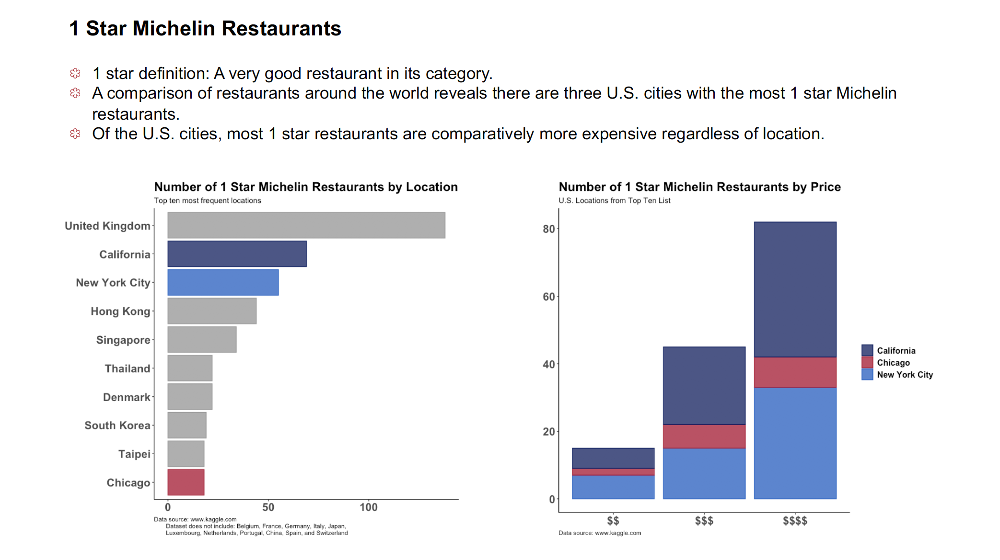

```R
# Jennifer Wanat, Assignment 2
# MSDS 455

# install and load needed packages
install.packages("ggplot2")
install.packages('plyr')
install.packages('tidyverse')

library(tidyverse)
library(plyr)
library(ggplot2)

# set working directory
setwd("~/Desktop/R/")

##################################
# michelin star restaurants
##################################

# Data source
# https://www.kaggle.com/jackywang529/michelin-restaurants

# Notice:
#Currently, the data only contains restaurant info in the following regions: 
#Austria, California, Chicago, Croatia, Czech Republic, Denmark, Finland, Greece, 
#Hong Kong, Hungary, Iceland, Macau, Norway, New York City, Poland, Ireland, 
#Rio de Janeiro, Sao Paulo, South Korea, Singapore, Sweden, Taipei, Thailand, 
#Washington DC, and United Kingdom
#and explicitly not including these regions: 
#Belgium, France, Germany, Italy, Japan, Luxembourg, Netherlands, Portugal, 
#China, Spain, and Switzerland

# load data set for one star Michelin restaurants
# source data in csv file
one_star <- read.csv("one-star-michelin-restaurants.csv")
# examine the first five rows of the data set
head(one_star)
summary(one_star)

# create new dataframe looking at frequency counts of cuisine
# this data set was not used for the assignment
cuisine <- count(one_star, 'cuisine')
head(cuisine, 10)
# create new dataframe of top ten most frequent cuisines
ten_cuisine <- head(cuisine[order(-cuisine$freq),], n=10)


################### First Chart #####################
#bar chart of top ten regions (cities)

# create new dataframe looking at frequency counts of region (cities)
# this data set was used for the assignment
region <- count(one_star, 'region')
# create new dataframe of top ten most frequent regions (cities)
ten_region <- head(region[order(-region$freq),], n=10)

#preparing dataframe for use
colnames(ten_region)
str(ten_region)
# Changing data type of columns
ten_region$region <- as.character(ten_region$region)
# Checking result
str(ten_region)

#this is the bar color palette color-coding US locations
bar_palette <- c("#b8042f","#999999", "#999999", "#999999", 
                 "#999999", "#999999", "#999999", "#0c63c9", 
                 "#061e67", "#999999")

ggplot(ten_region, aes(x=reorder(region, freq), y=freq)) +
  geom_bar(stat='identity', fill = bar_palette, color = bar_palette, alpha = 0.8) +
  labs(title="Number of 1 Star Michelin Restaurants by Location",
       subtitle="Top ten most frequent locations",
       caption = "Data source: www.kaggle.com
       Dataset does not include: Belgium, France, Germany, Italy, Japan,
       Luxembourg, Netherlands, Portugal, China, Spain, and Switzerland ") +
  coord_flip() +
  theme_classic() +
  theme(
  plot.title = element_text(face="bold", size=18),
  plot.caption = element_text(hjust = 0),
  axis.title.x = element_blank(),
  axis.title.y = element_blank(),
  axis.text.x = element_text(face="bold", size=16),
  axis.text.y = element_text(face="bold", size=16),
  legend.text = element_text(face="bold", size=12),
  legend.title = element_blank(),
  legend.position="bottom", legend.box = "horizontal")


################## Second Chart ######################
# stacked bar chart of cost by US cities

# create new dataframe looking at frequency counts of cost by US city
cost <- count(one_star, 'price')

#this bar chart has some N/A values
#this chart was not used
ggplot(cost, aes(price,freq)) +
  geom_bar(stat='identity')

#let's look at only US locations from the top ten
# California, New York City, Chicago
# create new dataframe with only restaurants in Chicago, California, NY City
us_cities <- subset(one_star, region %in% c('Chicago', 'California', 'New York City'))

# create new dataframe of frequency count of US locations by price
us_cost <- count(us_cities, 'price')

#stack bar chart of price by US cities
# This chart was used for the assignment
ggplot(us_cities, aes(price)) +
#  geom_bar(aes(fill=region), color= "black", alpha=0.8) +
  geom_bar(aes(fill=region, color=region), alpha=0.8) +
  scale_fill_manual(values=c("#061e67", "#b8042f", "#0c63c9"), name="region") +
  scale_color_manual(values=c("#061e67", "#b8042f", "#0c63c9"), name="region") +
  labs(title="Number of 1 Star Michelin Restaurants by Price",
       subtitle = "U.S. Locations from Top Ten List",
       caption = "Data source: www.kaggle.com") +
  theme_classic() +
  theme(
    plot.title = element_text(face="bold", size=18),
    plot.caption = element_text(hjust = 0),
    axis.title.x = element_blank(),
    axis.title.y = element_blank(),
    axis.text.x = element_text(face="bold", size=16),
    axis.text.y = element_text(face="bold", size=16),
    legend.text = element_text(face="bold", size=12),
    legend.title = element_blank())


#### Looking at the same data in a different way ###
# create new dataframe of frequency of price by US locations
counts <- ddply(us_cities, .(us_cities$price, us_cities$region), nrow)
# rename columns in counts dataframe
names(counts) <- c('price', 'city', 'freq')
# checking result
counts

# grouped bar chart of price by US locations
# this chart was not used for the assignment
ggplot(counts, aes(fill=city, y=freq, x=price)) + 
  geom_bar(position="dodge", stat="identity") +
  scale_fill_manual(values=c("#061e67", "#b8042f", "#0c63c9"), name="region") +
  scale_color_manual(values=c("#061e67", "#b8042f", "#0c63c9"), name="region") +
  labs(title="Number of 1 Star Michelin Restaurants by Price",
       subtitle = "U.S. Locations from Top Ten List",
       caption = "Data source: www.kaggle.com") +
  theme_classic() +
  theme(
    plot.title = element_text(face="bold", size=18),
    plot.caption = element_text(hjust = 0),
    axis.title.x = element_blank(),
    axis.title.y = element_blank(),
    axis.text.x = element_text(face="bold", size=16),
    axis.text.y = element_text(face="bold", size=16),
    legend.text = element_text(face="bold", size=12),
    legend.title = element_blank())


