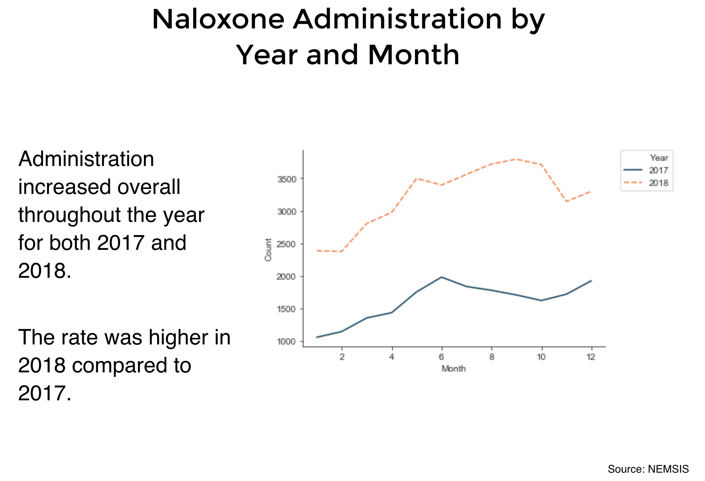

# Slides





# Code

## R
This is the code for the opioid related deaths. This was prepared in the programming language R.

```R
# Jennifer Wanat, Final Project
# Opioid related deaths for Cook County Medical Examiner
# MSDS 455

# install and load needed packages
install.packages('plyr')
install.packages('tidyverse')
install.packages('networkD3')
install.packages('dplyr')
install.packages('caret')
install.packages('ggmap')
install.packages('lubridate')
install.packages('RColorBrewer')
install.packages('gridExtra')


library(tidyverse)
library(plyr)
library(networkD3)
library(dplyr)
library(caret)
library(ggmap)
library(RColorBrewer)
library(gridExtra)
library(lubridate)

# set working directory
setwd("~/Desktop/R/")

##################################
# Medical Examiner Case Archive
##################################

# Data source
# https://datacatalog.cookcountyil.gov/Public-Safety/Medical-Examiner-Case-Archive/cjeq-bs86

# load data set for Cook County Medical Examiner
# source data in csv file
# if there are any blank entries, then replace with NA
me_cases <- read.csv("Medical_Examiner_Case_Archive.csv", header=T, na.strings=c("","NA"))
# examine the first five rows of the data set
head(me_cases)
summary(me_cases)
str(me_cases)


################ Preparing the data ####################

#convert date of death column from string to date
me_cases$FixedDate <- as.Date(me_cases$Date.of.Death,format="%m/%d/%Y")


# check frequency counts of opioid related deaths
opioid_count = count(me_cases, 'Opioid.Related')
opioid_count

#output
#Opioid.Related  freq
#1          false 26791
#2           true  5078


# create new dataframe of me_cases by gender, opioid.related, longitude, latitude
gender_opioid <- ddply(me_cases, .(me_cases$Gender, me_cases$Opioid.Related, me_cases$longitude, me_cases$latitude), nrow)
# check results
summary(gender_opioid)
str(gender_opioid)

#renaming the columns in the dataframe
names(gender_opioid) <- c('Gender', 'Opioid', 'longitude', 'latitude', 'value')


#let's look at only opioid deaths equal to true
#this dataframe will be used to create the map
# create new dataframe 
gender_opioid_only <- subset(gender_opioid, Opioid %in% c('true'))
# removing the NA's from the dataframe
gender_opioid_only <- na.omit(gender_opioid_only)
# checking the results
summary(gender_opioid_only)


# create new dataframe of me_cases by date, gender, opioid.related, longitude, latitude
gender_opioid_date <- ddply(me_cases, .(me_cases$FixedDate, me_cases$Gender, me_cases$Opioid.Related, 
                                        me_cases$longitude, me_cases$latitude), nrow)
# check results
summary(gender_opioid_date)
str(gender_opioid_date)

#renaming the columns in the dataframe
names(gender_opioid_date) <- c('Date', 'Gender', 'Opioid', 'longitude', 'latitude', 'value')
str(gender_opioid_date)


#let's look at only opioid deaths equal to true
# create new dataframe 
gender_opioid_date <- subset(gender_opioid_date, Opioid %in% c('true'))
# removing the NA's from the dataframe
gender_opioid_date <- na.omit(gender_opioid_date)


################## Preparing the map #####################


#https://statisticaloddsandends.wordpress.com/2018/10/25/getting-started-stamen-maps-with-ggmap/
#set map boundaries based on data
height <- max(gender_opioid_only$latitude) - min(gender_opioid_only$latitude)
width <- max(gender_opioid_only$longitude) - min(gender_opioid_only$longitude)
chi_borders <- c(bottom  = min(gender_opioid_only$latitude)  - 0.1 * height,
                 top     = max(gender_opioid_only$latitude)  + 0.1 * height,
                 left    = min(gender_opioid_only$longitude) - 0.1 * width,
                 right   = max(gender_opioid_only$longitude) + 0.1 * width)


#create basic map with specified type
map <- get_stamenmap(chi_borders, zoom = 10, maptype = "toner-lines") 

#this shows the map
ggmap(map)


################# 2018 #######################

#https://stackoverflow.com/questions/28335715/r-how-to-filter-subset-a-sequence-of-dates
#filtering opioid related deaths by date
#looking for 2018
gender_opioid_date2018 <- filter(gender_opioid_date, between(Date, as.Date("2018-01-01"), as.Date("2018-12-31")))


#create map with 2018 data points
map2018 <- ggmap(map) + 
  geom_point(data = gender_opioid_date2018, mapping = aes(x = longitude, y = latitude,
                                                          col = Gender), alpha=0.5) +
  labs(title="2018") +
#       subtitle="2018",
#       caption = "Data source: Cook County Medical Examiner") +
  scale_color_manual(values=c("#f95d6a", "#2f4b7c")) +
  theme(
    plot.title = element_text(face="bold", size=20),
    plot.caption = element_text(hjust = 0),
    axis.title.x = element_blank(),
    axis.title.y = element_blank(),
    axis.ticks = element_blank(),
    axis.text.x = element_blank(),
    axis.text.y = element_blank(),
    legend.text = element_text(face="bold", size=12),
    legend.title = element_blank(),
    legend.position= "none")
#    legend.position="bottom", legend.box = "horizontal")

#show map with 2018 data points
map2018


#########################################
#stacked bar chart of male v female by year

#https://community.rstudio.com/t/converting-dates-year-month-day-to-3-separate-columns-year-month-day/8585
gender_opioid_date <- gender_opioid_date %>%
  dplyr::mutate(Year = lubridate::year(Date), 
                Month = lubridate::month(Date), 
                Day = lubridate::day(Date))

# create new dataframe of frequency count of gender by year for opioid related deaths
gender_counts <- ddply(gender_opioid_date, .(gender_opioid_date$Year, gender_opioid_date$Gender), nrow)

# rename columns in dataframe
names(gender_counts) <- c('Year', 'Gender', 'freq')

#remove 2019 data since this is incomplete
gender_counts <- gender_counts[!(gender_counts$Year=="2019"),]


#this is to assist in labeling every year in the subsequent stacked bar chart
ii <- 2014:2018

#stacked bar chart
ggplot(gender_counts, aes(fill=Gender, y=freq, x=Year)) + 
  geom_bar(position="stack", stat="identity") +
  scale_fill_manual(values=c("#f95d6a", "#2f4b7c"), name="region") +
  scale_color_manual(values=c("#f95d6a", "#2f4b7c"), name="region") +
  scale_x_continuous(breaks=ii) +
  labs(title="Number of Opioid Related Deaths by Gender",
       subtitle = "Cook County Medical Examiner",
       caption = "Data source: Cook County Open Data") +
  theme_classic() +
  theme(
    plot.title = element_text(face="bold", size=18),
    plot.caption = element_text(hjust = 0),
    axis.title.x = element_blank(),
    axis.title.y = element_blank(),
    axis.text.x = element_text(face="bold", size=16),
    axis.text.y = element_text(face="bold", size=16),
    legend.text = element_text(face="bold", size=12),
    legend.title = element_blank())

```
## Python
This is the code for the opioid related deaths. This was prepared in the programming language Python.
```python
#!/usr/bin/env python
# coding: utf-8

# ## Jennifer Wanat
# ## MSDS 455 - Final Project
# 
# ## Naloxone use
# 


#Import libraries needed for analysis
import pandas as pd                                  #Import pandas library as pd
import numpy as np                                   #import numpy library as np
import matplotlib.pyplot as plt                      #import matplotlib.pyplot library
import seaborn as sns                                #import seaborn library as sns


# ## Chart One - Gender


#Read CSV file into pandas data frame
gender_df = pd.read_csv('counts_by_gender.csv')         
#check dataframe
gender_df   

# rename the columns in the gender_df
gender_df.columns = ['Dispatch_Complaint', 'Medication_Given', 'Year', 'Gender', 'Count']

# check results
gender_df

# check datatype of columns
gender_df.dtypes

#remove commas from objects in Count column and convert to integer
gender_df['Count'] = gender_df['Count'].str.replace(',', '').astype(int)
                    
# check dataframe data types
gender_df.dtypes

#check to verify results
gender_df

#Create new dataframe mf_gender_df
#Return the rows that have 'Female' or 'Male' listed for gender
mf_gender_df = gender_df[(gender_df['Gender'] == 'Female') | (gender_df['Gender'] == 'Male')]
#return the rows that have '2017' or '2018' listed for year
# Year 2019 is not complete
mf_gender_df = mf_gender_df[(mf_gender_df['Year'] == 2017) | (mf_gender_df['Year'] == 2018)]


#check results
mf_gender_df

#Controlling figure aesthetics
#https://seaborn.pydata.org/tutorial/aesthetics.html

# Pointplot comparing gender counts by year
sns.set_style("ticks")
color_palette = ["#f95d6a", "#2f4b7c"]
sns.set_palette(color_palette)
c1 = sns.pointplot(x='Year', y='Count', hue='Gender', 
                   data=mf_gender_df), sns.despine()

sns.despine()
# Put the legend out of the figure
# https://stackoverflow.com/questions/30490740/move-legend-outside-figure-in-seaborn-tsplot
#plt.legend(bbox_to_anchor=(1.05, 1), loc=2, borderaxespad=0.)
plt.legend(loc=2)
plt.savefig('Gender_Pointplot_no_grid', bbox_inches="tight")
plt.show()


# ## Chart Two - Geographical Region

#Read CSV file into pandas data frame
region_df = pd.read_csv('urban_geographical_region.csv')         
#check dataframe
region_df.head()

# check dataframe data types
region_df.dtypes

# rename the columns in the geographical_df
region_df.columns = ['Dispatch_Complaint', 'Medication_Given', 'Year', 'Urbanicity', 'Region', 'Count']
#remove commas from objects in Count column and convert to integer
region_df['Count'] = region_df['Count'].str.replace(',', '').astype(int)
                    
# check dataframe data types
region_df.dtypes


#check dataframe
region_df.head()


#Create new dataframe yr_region_df
#return the rows that have '2017' or '2018' listed for year
# Year 2019 is not complete
yr_region_df = region_df[(region_df['Year'] == 2017) | (region_df['Year'] == 2018)]

#check results
yr_region_df

#create new dataframe with region dataframe that only contains 2017 results
yr17_region_df = region_df[(region_df['Year'] == 2017)]

#check results
yr17_region_df


# ## Sankey

#https://plot.ly/python/sankey-diagram/
# import library to make Sankey diagram
import plotly.graph_objects as go


# create function to assign numbers to urbanicity categories
# this function is needed to make Sankey diagram

def urb(row):
    if row['Urbanicity'] == 'Frontier':
        val = '0'
    elif row['Urbanicity'] == 'Not Recorded':
        val = '1'
    elif row['Urbanicity'] == 'Rural':
        val = '2'    
    elif row['Urbanicity'] == 'Suburban':
        val = '3'
    elif row['Urbanicity'] == 'Urban':
        val = '4'
    return val


#apply urb function to yr17_region_df dataframe column
#put results into new column called 'Source'

yr17_region_df['Source'] = yr17_region_df.apply(urb, axis=1)


# create function to assign numbers to region categories
# this function is needed to make Sankey diagram

def tar(row):
    if row['Region'] == 'Midwest':
        val = '5'
    elif row['Region'] == 'Northeast':
        val = '6'
    elif row['Region'] == 'South':
        val = '7'    
    elif row['Region'] == 'West':
        val = '8'
    elif row['Region'] == 'Not Recorded':
        val = '9'
    elif row['Region'] == 'Territories':
        val = '10'
    return val


#apply tar function to yr17_region_df dataframe column
#put results into new column called 'Target'
yr17_region_df['Target'] = yr17_region_df.apply(tar, axis=1)


#https://plot.ly/python/sankey-diagram/

fig = go.Figure(data=[go.Sankey(
    node = dict(
      pad = 15,
      thickness = 20,
      line = dict(color = "black", width = 0.5),
      label = ["Frontier", "Not Recorded", "Rural", "Suburban", "Urban", 
              "Midwest", "Northeast", "South", "West", "Not Recorded", "Territories" ],
      color = ("#003f5c", "#2f4b7c", "#665191", "#a05195", "#d45087",
              "#f95d6a", "#ff7c43", "#ffa600", "#003f5c")
    ),
    link = dict(
      source = yr17_region_df['Source'], # indices correspond to labels, eg A1, A2, A2, B1, ...
      target = yr17_region_df['Target'],
      value = yr17_region_df['Count']
  ))])

fig.update_layout(title_text="2017", font_size=14)
fig.write_image("Saneky_region_2017.png")
fig.show()


#create new dataframe with region dataframe that only contains 2018 results
yr18_region_df = region_df[(region_df['Year'] == 2018)]
#check results
yr18_region_df


#apply urb function to yr17_region_df dataframe column
#put results into new column called 'Source'
yr18_region_df['Source'] = yr18_region_df.apply(urb, axis=1)

#apply tar function to yr18_region_df dataframe column
#put results into new column called 'Target'
yr18_region_df['Target'] = yr18_region_df.apply(tar, axis=1)

#check results
yr18_region_df


#https://plot.ly/python/sankey-diagram/

fig = go.Figure(data=[go.Sankey(
    node = dict(
      pad = 15,
      thickness = 20,
      line = dict(color = "black", width = 0.5),
      label = ["Frontier", "Not Recorded", "Rural", "Suburban", "Urban", 
              "Midwest", "Northeast", "South", "West", "Not Recorded", "Territories" ],
      color = ("#003f5c", "#2f4b7c", "#665191", "#a05195", "#d45087" ,
              "#f95d6a","#ff7c43", "#ffa600", "#003f5c")
    ),
    link = dict(
      source = yr18_region_df['Source'], # indices correspond to labels, eg A1, A2, A2, B1, ...
      target = yr18_region_df['Target'],
      value = yr18_region_df['Count']
  ))])

fig.update_layout(title_text="2018", font_size=14) 
fig.write_image("Saneky_region_2018.png")
fig.show()


# ## Chart Three - Ethnicity

#Read CSV file into pandas data frame
race_df = pd.read_csv('counts_by_race.csv')         
#check dataframe
race_df.head()


# rename the columns in the race_df
race_df.columns = ['Dispatch_Complaint', 'Medication_Given', 'Year', 'Race', 'Count']

#check result
race_df


# check datatype of columns
race_df.dtypes


#remove commas from objects in Count column and convert to integer
race_df['Count'] = race_df['Count'].str.replace(',', '').astype(int)
                    
# check dataframe data types
race_df.dtypes


#return the rows that have '2017' or '2018' listed for year
# Year 2019 is not complete
yr_race_df = race_df[(race_df['Year'] == 2017) | (race_df['Year'] == 2018)]

# check results
yr_race_df


#create dataframe of race results from 2017
yr17_race_df = yr_race_df[(yr_race_df['Year'] == 2017)]

#drop columns that aren't needed to create waffle chart
yr17_race_df = yr17_race_df.drop(columns='Dispatch_Complaint')
yr17_race_df = yr17_race_df.drop(columns='Medication_Given')
yr17_race_df = yr17_race_df.drop(columns='Year')

#check result
yr17_race_df


#the counts are too high to be used effectively in a waffle chart
#will divide counts by 100 to scale
#create new column of Scaled Count
yr17_race_df['Scaled_Count'] = yr17_race_df['Count']/100


#drop column that isn't need to create waffle chart
yr17_race_scaled_df = yr17_race_df.drop(columns='Count')

#check results
yr17_race_scaled_df


#! pip install pywaffle
# Reference: https://stackoverflow.com/questions/41400136/how-to-do-waffle-charts-in-python-square-piechart
from pywaffle import Waffle

#determine number of categories based on shape of dataframe
n_categories = yr17_race_scaled_df.shape[0]
#specify colors to be used in waffle chart
colors = ['#003f5c','#2f4b7c','#665191','#a05195','#d45087','#f95d6a','#ff7c43','#ffa600']


# Draw Plot and Decorate
fig = plt.figure(
    FigureClass=Waffle,
    plots={
        '111': {
            'values': yr17_race_scaled_df['Scaled_Count'],
            'labels': ["{0}".format(n) for n in yr17_race_scaled_df['Race']],
            'legend': {'loc': 'upper left', 'bbox_to_anchor': (1.05, 1), 'fontsize': 12},
            'title': {'label': '2017', 'loc': 'center', 'fontsize':24}
        },
    },
    rows=8,
    colors=colors,
    figsize=(16, 9)
)
plt.savefig('Race_waffle_2017', bbox_inches="tight")


# initial dataframe yr_race_df
#create dataframe of race results from 2018
yr18_race_df = yr_race_df[(yr_race_df['Year'] == 2018)]

#drop columns that aren't needed to create waffle chart
yr18_race_df = yr18_race_df.drop(columns='Dispatch_Complaint')
yr18_race_df = yr18_race_df.drop(columns='Medication_Given')
yr18_race_df = yr18_race_df.drop(columns='Year')

#the counts are too high to be used effectively in a waffle chart
#will divide counts by 100 to scale
#create new column of Scaled Count
yr18_race_df['Scaled_Count'] = yr18_race_df['Count']/100

#drop column that isn't need to create waffle chart
yr18_race_scaled_df = yr18_race_df.drop(columns='Count')

#check results
yr18_race_scaled_df


#determine number of categories based on shape of dataframe
n_categories = yr18_race_scaled_df.shape[0]
#specify colors to be used in waffle chart
colors = ['#003f5c','#2f4b7c','#665191','#a05195','#d45087','#f95d6a','#ff7c43','#ffa600']


# Draw Plot and Decorate
fig = plt.figure(
    FigureClass=Waffle,
    plots={
        '111': {
            'values': yr18_race_scaled_df['Scaled_Count'],
 #           'labels': ["{0} {1}".format(n[0], n[1]) for n in yr18_race_scaled_df[['Race', 'Scaled_Count']].itertuples()],
            'labels': ["{0}".format(n) for n in yr17_race_scaled_df['Race']],
            'legend': {'loc': 'upper left', 'bbox_to_anchor': (1.05, 1), 'fontsize': 12},
            'title': {'label': '2018', 'loc': 'center', 'fontsize':24}
        },
    },
    rows=8,
    colors=colors,
    figsize=(16, 9)
)
plt.savefig('Race_waffle_2018', bbox_inches="tight")


# ## Chart Four - Month and Year

#Read CSV file into pandas data frame
calendar_df = pd.read_csv('year_month.csv')         
#check dataframe
calendar_df.head()


# rename the columns in the calendar_df
calendar_df.columns = ['Dispatch_Complaint', 'Medication_Given', 'Year', 'Month', 'Count']

#check result
calendar_df.dtypes


#https://stackoverflow.com/questions/21702342/creating-a-new-column-based-on-if-elif-else-condition
#create function that gives month name based on number
def f(row):
    if row['Month'] == 1:
        val = 'Jan'
    elif row['Month'] == 2:
        val = 'Feb'
    elif row['Month'] == 3:
        val = 'Mar'    
    elif row['Month'] == 4:
        val = 'Apr'
    elif row['Month'] == 5:
        val = 'May'
    elif row['Month'] == 6:
        val = 'Jun'
    elif row['Month'] == 7:
        val = 'Jul'
    elif row['Month'] == 8:
        val = 'Aug'
    elif row['Month'] == 9:
        val = 'Sep'
    elif row['Month'] == 10:
        val = 'Oct'
    elif row['Month'] == 11:
        val = 'Nov'
    elif row['Month'] == 12:
        val = 'Dec'
    return val


#apply function f to columns of calendar_df
#create new column Month_Name that contains results
calendar_df['Month_Name'] = calendar_df.apply(f, axis=1)

#check results
calendar_df


#return the rows that have '2017' or '2018' listed for year
# Year 2019 is not complete
o1718_calendar_df = calendar_df[(calendar_df['Year'] == 2017) | (calendar_df['Year'] == 2018)]

# check results
o1718_calendar_df


#the count column is a string instead of a number
#remove comma from string
#convert string to integer
o1718_calendar_df['Count'] = o1718_calendar_df['Count'].str.replace(',', '').astype(int)

#drop columns from dataframe that aren't needed
o1718_calendar_df = o1718_calendar_df.drop(columns='Dispatch_Complaint')
o1718_calendar_df = o1718_calendar_df.drop(columns='Medication_Given')

#check results
o1718_calendar_df


import seaborn as sns


#plt.figure(figsize=(10,7), dpi= 80)
#this makes a bigger chart with fig, ax split
#fig, ax = plt.subplots(figsize=(13,10), dpi= 80)  
sns.set_style("ticks")
color_palette2b = ["#003f5c", "#ff7c43"]
sns.set_palette(color_palette)
sns.lineplot(x="Month", y="Count",
             hue="Year", style="Year", palette=color_palette2b,
             data=o1718_calendar_df)
sns.despine()

#labels2 = ['Jan','Jan','Feb','Mar','Apr','May','Jun','Jul','Aug','Sep','Oct','Nov','Dec']
#labels2 = ['Feb','Apr','Jun','Aug','Oct','Dec']
#ax.xaxis.set_major_formatter(plt.FixedFormatter(labels2))
#ax.tick_params(axis='both', which='Minor', labelsize=14)
#ax.tick_params(axis='both', which='Major', labelsize=14)
# Put the legend out of the figure
# https://stackoverflow.com/questions/30490740/move-legend-outside-figure-in-seaborn-tsplot
plt.legend(bbox_to_anchor=(1.05, 1), loc=2, borderaxespad=0.)
#plt.legend()
#plt.set(xticklabels=[])
plt.savefig('Year_month_line_no_grid', bbox_inches="tight")
plt.show()


# ## Chart Five - population pyramid based on age

#Read CSV file into pandas data frame
gender_age_df = pd.read_csv('gender_age_group.csv')         
#check dataframe
gender_age_df.head()

# rename the columns in the calendar_df
gender_age_df.columns = ['Dispatch_Complaint', 'Medication_Given', 'Year', 'Gender', 'Age', 'Count']

#check result
gender_age_df

#return the rows that have '2017' or '2018' listed for year
# Year 2019 is not complete
yr_gender_age_df = gender_age_df[(gender_age_df['Year'] == 2017) | (gender_age_df['Year'] == 2018)]

# check results
yr_gender_age_df


# remove rows that specify Not Applicable or Not Recorded for Age
yr_gender_age_df = yr_gender_age_df[yr_gender_age_df.Age != 'Not Applicable'] 
yr_gender_age_df = yr_gender_age_df[yr_gender_age_df.Age != 'Not Recorded']


#Return the rows that have 'Female' or 'Male' listed for gender
yr_gender_age_df = yr_gender_age_df[(yr_gender_age_df['Gender'] == 'Female') | (yr_gender_age_df['Gender'] == 'Male')]

#check data types of columns
yr_gender_age_df.dtypes


#remove commas from objects in Count column and convert to integer
yr_gender_age_df['Count'] = yr_gender_age_df['Count'].str.replace(',', '').astype(int)

#replace '17-Nov' string in Age column with age group '11-17'
yr_gender_age_df['Age'] = yr_gender_age_df['Age'].replace('17-Nov', '11-17')
                    
# check dataframe data types
yr_gender_age_df.dtypes


#create dataframe of gender/age results from 2017
yr17_gender_age_df = yr_gender_age_df[(yr_gender_age_df['Year'] == 2017)]

# remove rows that specify 91-100 or 101-110 or 111-120 for Age
yr17_gender_age_df = yr17_gender_age_df[yr17_gender_age_df.Age != '91-100'] 
yr17_gender_age_df = yr17_gender_age_df[yr17_gender_age_df.Age != '101-110']
yr17_gender_age_df = yr17_gender_age_df[yr17_gender_age_df.Age != '111-120']


#convert female counts to be negative so the bars point in the opposite direction of male
yr17_gender_age_df.loc[(yr17_gender_age_df.Gender == 'Female'), 'Count'] *= -1    

#check results
yr17_gender_age_df


#https://www.machinelearningplus.com/plots/top-50-matplotlib-visualizations-the-master-plots-python/
# population pyramid    
# 2017

# Draw Plot
#the next line makes a smaller chart
#fig, ax = plt.subplots(figsize=(8, 5))   
#the next line makes a bigger chart
plt.figure(figsize=(10,7), dpi= 80)

#this makes a bigger chart with fig, ax split
fig, ax = plt.subplots(figsize=(13,10), dpi= 80)  
group_col = 'Gender'
order_of_bars = yr17_gender_age_df.Age.unique()[::-1]
#colors = [plt.cm.Spectral(i/float(len(yr17_gender_age_df[group_col].unique())-1)) for i in range(len(yr17_gender_age_df[group_col].unique()))]
colors = ["#f95d6a", "#2f4b7c"]

for c, group in zip(colors, yr17_gender_age_df[group_col].unique()):
    sns.barplot(x='Count', y='Age', data=yr17_gender_age_df.loc[yr17_gender_age_df[group_col]==group, :], order=order_of_bars, color=c, label=group)

# Decorations    
plt.xlabel("Count", fontsize=18)
plt.ylabel("Age", fontsize=18)
plt.yticks(fontsize=12)
#xlabels = ['2000', '1000', '0', '1000', '2000', '3000', '4000']
#plt.set(xticklabels=[])
#plt.set_xticklabels(xlabels)
#a=plt.get_xticklabels().tolist()
#a[0]='2000'
#a[1]='1000'
#axes.set_xticklabels(a)

#plt.xticks(labels)
#ax.set_axis_labels(['2000', '1000', '0', '1000', '2000', '3000', '4000'])
labels = ['2000','2000', '1000', '0', '1000', '2000', '3000', '4000']

# specify axis tick label size
#https://stackoverflow.com/questions/6390393/matplotlib-make-tick-labels-font-size-smaller/11386056#11386056
ax.xaxis.set_major_formatter(plt.FixedFormatter(labels))
ax.tick_params(axis='both', which='major', labelsize=14)
plt.title("2017", fontsize=30)
#plt.legend()
plt.savefig('Gender_2017_age_population_pyramid', bbox_inches="tight")
plt.show()


# ### same chart for 2018

#create dataframe of gender/age results from 2018
yr18_gender_age_df = yr_gender_age_df[(yr_gender_age_df['Year'] == 2018)]


# remove rows that specify 91-100 or 101-110 or 111-120 for Age
yr18_gender_age_df = yr18_gender_age_df[yr18_gender_age_df.Age != '91-100'] 
yr18_gender_age_df = yr18_gender_age_df[yr18_gender_age_df.Age != '101-110']
yr18_gender_age_df = yr18_gender_age_df[yr18_gender_age_df.Age != '111-120']


#convert female counts to be negative so the bars point in the opposite direction of male
yr18_gender_age_df.loc[(yr18_gender_age_df.Gender == 'Female'), 'Count'] *= -1    

#check results
yr18_gender_age_df


#https://www.machinelearningplus.com/plots/top-50-matplotlib-visualizations-the-master-plots-python/
# population pyramid    
# 2018

# Draw Plot
#the next line makes a smaller chart
#fig, ax = plt.subplots(figsize=(8, 5))   
#the next line makes a bigger chart
plt.figure(figsize=(10,7), dpi= 80)

#this makes a bigger chart with fig, ax split
fig, ax = plt.subplots(figsize=(13,10), dpi= 80)  
group_col = 'Gender'
order_of_bars = yr18_gender_age_df.Age.unique()[::-1]
#colors = [plt.cm.Spectral(i/float(len(yr17_gender_age_df[group_col].unique())-1)) for i in range(len(yr17_gender_age_df[group_col].unique()))]
colors = ["#f95d6a", "#2f4b7c"]

for c, group in zip(colors, yr18_gender_age_df[group_col].unique()):
    sns.barplot(x='Count', y='Age', data=yr18_gender_age_df.loc[yr18_gender_age_df[group_col]==group, :], order=order_of_bars, color=c, label=group)

# Decorations    
plt.xlabel("Count", fontsize=18)
plt.ylabel("Age", fontsize=18)
plt.yticks(fontsize=12)
#xlabels = ['2000', '1000', '0', '1000', '2000', '3000', '4000']
#plt.set(xticklabels=[])
#plt.set_xticklabels(xlabels)
#a=plt.get_xticklabels().tolist()
#a[0]='2000'
#a[1]='1000'
#axes.set_xticklabels(a)

#plt.xticks(labels)
#ax.set_axis_labels(['2000', '1000', '0', '1000', '2000', '3000', '4000'])
labels = ['2000','2000', '1000', '0', '1000', '2000', '3000', '4000']
#https://jakevdp.github.io/PythonDataScienceHandbook/04.10-customizing-ticks.html
ax.xaxis.set_major_formatter(plt.FixedFormatter(labels))
ax.tick_params(axis='both', which='major', labelsize=14)
plt.title("2018", fontsize=30)
#plt.legend()
plt.savefig('Gender_2018_age_population_pyramid', bbox_inches="tight")
plt.show()


