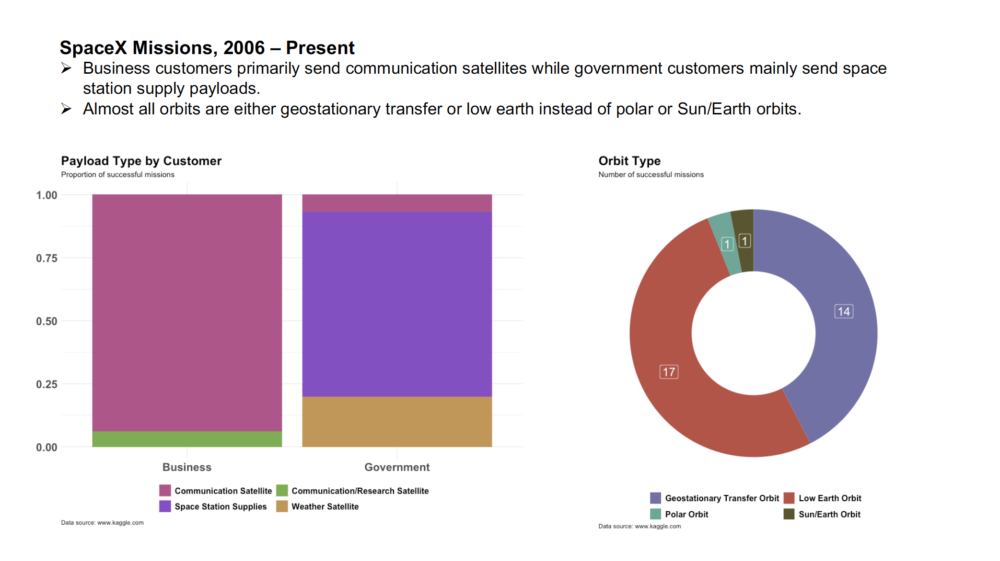

```R
# Jennifer Wanat, Assignment 3
# MSDS 455

# install and load needed packages
install.packages("ggplot2")
install.packages('plyr')
install.packages('tidyverse')
install.packages('ggthemes')

library(tidyverse)
library(plyr)
library(ggplot2)
library(ggthemes)

# set working directory
setwd("~/Desktop/R/")

##################################
# SpaceX Missions, 2006 - present
##################################

# Data source
# https://www.kaggle.com/spacex/spacex-missions/download


# load data set for SpaceX missions
# source data in csv file
# if there are any blank entries, then replace with NA
missions <- read.csv("spacex_database.csv", header=T, na.strings=c("","NA"))
# examine the first five rows of the data set
head(missions)
summary(missions)
str(missions)


#create new dataframe with only successful Mission.Outcome
success_mission <- subset(missions, Mission.Outcome %in% c('Success'))

# examine the first five rows of the data set
head(success_mission)

#examine the structure of the dataframe
str(success_mission)

################## First Chart ##########################
###### Payload Type by Customer #######
# create new dataframe using the success_mission dataframe
# this new dataframe provides the counts of each customer and payload type
# this data set was used for the assignment
other_payload_counts <- ddply(success_mission, .(success_mission$Customer.Type, success_mission$Payload.Type), nrow)
#renaming the columns in the dataframe
names(other_payload_counts) <- c('Types', 'Payload', 'freq')
# checking the results
str(other_payload_counts)
summary(other_payload_counts)

# removing the NA's from the dataframe
other_payload_counts <- na.omit(other_payload_counts)
# checking the results
str(other_payload_counts)


###using this chart for the assignment
# percent stacked bar 
ggplot(other_payload_counts, aes(fill=Payload, y=freq, x=Types)) + 
  geom_bar(position="fill", stat="identity", aes(color=Payload)) +
  scale_fill_manual(values=c("#ba4f8d","#70af46","#8b4ac8","#c7964c"), name="region") +
  scale_color_manual(values=c("#ba4f8d","#70af46","#8b4ac8","#c7964c"), name="region") +
  labs(title="Payload Type by Customer",
       subtitle = "Proportion of successful missions",
       caption = "Data source: www.kaggle.com") +
  theme_minimal() +
  guides(fill=guide_legend(nrow=2,byrow=TRUE)) +
  theme(
    plot.title = element_text(face="bold", size=18),
    plot.caption = element_text(hjust = 0),
    panel.border = element_blank(),
    axis.title.x = element_blank(),
    axis.title.y = element_blank(),
    axis.text.x = element_text(face="bold", size=16),
    axis.text.y = element_text(face="bold", size=16),
    legend.text = element_text(face="bold", size=12),
    legend.title = element_blank(), 
    legend.position = 'bottom')


############ Second Chart #################################
############ Payload Orbit ################################
#creating new dataframe of payload orbit type
orbit_type <- ddply(success_mission, .(success_mission$Payload.Orbit), nrow)
#renaming the columns in the dataframe
names(orbit_type) <- c('Orbit_Type', 'freq')
#checking result
str(orbit_type)

# refer to https://www.r-graph-gallery.com/128-ring-or-donut-plot.html
# Compute percentages
orbit_type$fraction = orbit_type$freq / sum(orbit_type$freq)

# Compute the cumulative percentages (top of each rectangle)
orbit_type$ymax = cumsum(orbit_type$fraction)

# Compute the bottom of each rectangle
orbit_type$ymin = c(0, head(orbit_type$ymax, n=-1))

# Compute label position
orbit_type$labelPosition <- (orbit_type$ymax + orbit_type$ymin) / 2

# Compute a good label
orbit_type$label <- paste0(orbit_type$freq)

# using this chart for the assignment
#Donut chart 
ggplot(orbit_type, aes(ymax=ymax, ymin=ymin, xmax=4, xmin=3, fill=Orbit_Type)) +
  geom_rect() +
  labs(title="Orbit Type",
       subtitle = "Number of successful missions",
       caption = "Data source: www.kaggle.com") +
  scale_fill_manual(values=c("#7270a9","#bf4e44","#5ba996","#5b552c"), name="region") +
  scale_color_manual(values=c("#7270a9","#bf4e44","#5ba996","#5b552c"), name="region") +
  geom_label(x=3.5, color='white', aes(y=labelPosition, label=label), size=6, show.legend=FALSE) +
#  the show.legend=FALSE removes the "a" from the color patches in the legend
  coord_polar(theta="y") +
  xlim(c(2, 4)) +
  theme_void() +
  theme(plot.title = element_text(face="bold", size=18),
        plot.caption = element_text(hjust = 0),
        legend.title = element_blank(),
        legend.text = element_text(face="bold", size=12),
        legend.position="bottom") +
  guides(fill=guide_legend(nrow=2,byrow=TRUE))


