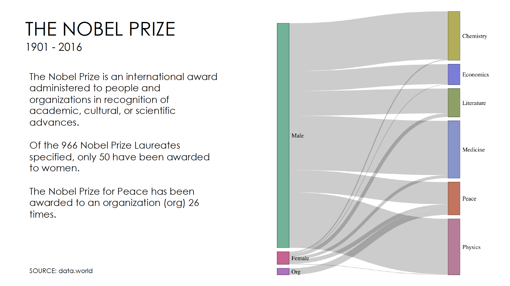

```R
# Jennifer Wanat, Assignment 4
# MSDS 455

# install and load needed packages
install.packages('plyr')
install.packages('tidyverse')
install.packages('networkD3')
install.packages('dplyr')

library(tidyverse)
library(plyr)
library(networkD3)
library(dplyr)


# set working directory
setwd("~/Desktop/R/")

##################################
# Nobel Prize Winners
##################################

# Data source
# https://data.world/sya/nobel-prize-winners


# load data set for Nobel Prize Winners
# source data in csv file
# if there are any blank entries, then replace with NA
prize <- read.csv("nobel_prize_by_winner.csv", header=T, na.strings=c("","NA"))
# examine the first five rows of the data set
head(prize)
summary(prize)
str(prize)


#Capitalizing the factors in the category and gender columns
#https://stackoverflow.com/questions/35974571/lower-case-for-a-factor-data-frame-column
#https://stackoverflow.com/questions/18509527/first-letter-to-upper-case
levels(prize$category) <- stringr::str_to_title(levels(prize$category))
levels(prize$gender) <- stringr::str_to_title(levels(prize$gender))

# check results
str(prize)

######################################
# create new dataframe of prize by gender, category
gender_cat <- ddply(prize, .(prize$gender, prize$category), nrow)
# check results
summary(gender_cat)

#renaming the columns in the dataframe
names(gender_cat) <- c('Gender', 'Category', 'Value')
# removing the NA's from the dataframe
gender_cat <- na.omit(gender_cat)
# checking the results
summary(gender_cat)


################### First Chart #####################
#making a sankey
# From these flows we need to create a node data frame: it lists every entities involved in the flow
nodes <- data.frame(
  name=c(as.character(gender_cat$Gender), 
         as.character(gender_cat$Category)) %>% unique()
)

# With networkD3, connection must be provided using id, not using real name like in the links dataframe.. So we need to reformat it.
gender_cat$IDsource <- match(gender_cat$Gender, nodes$name)-1 
gender_cat$IDtarget <- match(gender_cat$Category, nodes$name)-1


# prepare colour scale
ColourScal ='d3.scaleOrdinal() .range(["#d14a87","#4aac8b","#b35bc0","#aaa533","#6b6dda","#7e964e","#7589c8","#ca5f45","#b96b8d"])'


# Make the Network
sankey_chart <- sankeyNetwork(Links = gender_cat, Nodes = nodes,
                   Source = "IDsource", Target = "IDtarget",
                   Value = "Value", NodeID = "name", 
                   sinksRight=FALSE,
                   colourScale=ColourScal,
                   fontSize=15, nodeWidth=30)
sankey_chart


################# Looking at value counts ##########
# create new dataframe of prize by gender, category
gender_count <- ddply(prize, .(prize$gender, prize$category), nrow)
names(gender_count) <- c('Gender', 'Category', 'Value')
# removing the NA's from the dataframe
gender_count <- na.omit(gender_count)
# check result
summary(gender_count)

# how many Nobel Laureates are there?
sum(gender_count$Value)
#966 values total

# The chart in R is interactive and if I hover the cursor over the chart
# there are 50 Females Laureates and 26 Organization Laureates


