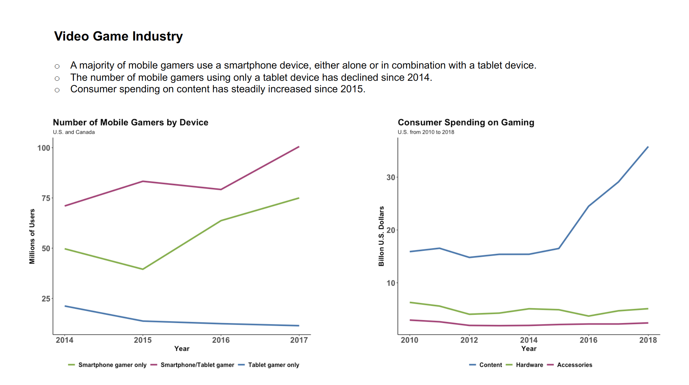

```R
# Jennifer Wanat, Assignment 1
# MSDS 455

# install and load needed packages
install.packages("readxl")
install.packages("lattice")
install.packages("ggplot2")
install.packages("reshape")
library(readxl)
library(lattice)
library(ggplot2)
library(reshape)

# set working directory
setwd("~/Desktop/R/")


################### First Chart #####################
# load data set for number of users by device
# source data in csv file
vg_device <- read.csv("statistic_number-of-mobile-gamers-in-north-america-2014-2017-by-device.csv")
# examine the first five rows of the data set
head(vg_device)

# Preparing the data set for use
# Renaming the data columns
names(vg_device) <- c('Device', '2014', '2015', '2016', '2017')

# Combining the year columns into one column
vg_device2 <- melt(vg_device, id.vars=c('Device'),var='Year')
# Checking result
head(vg_device2)

# Changing data type of columns
str(vg_device2)
vg_device2$Device <- as.character(vg_device2$Device)
vg_device2$Year <- as.character(vg_device2$Year)
vg_device2$Year <- as.numeric(vg_device2$Year)
# Checking result
str(vg_device2)


# Area chart
# This chart was not used for the assignment
ggplot(vg_device2, aes(x=Year, y=value, fill=Device)) + 
  geom_area() +
  scale_fill_manual(values=c('#78B138', '#B13878', '#3878B1')) +
  theme_classic() + 
  labs(title="Number of Mobile Gamers by Device", subtitle="U.S. and Canada", y="Millions of Users", x="Year") +
  theme(
    plot.title = element_text(face="bold", size=18),
    axis.title.x = element_text(face="bold", size=14),
    axis.title.y = element_text(face="bold", size=14),
    axis.text.x = element_text(face="bold", size=16),
    axis.text.y = element_text(face="bold", size=16),
    legend.text = element_text(face="bold", size=12),
    legend.title = element_text(face="bold", size=12))

# Line chart
# This chart was used for the assignment
ggplot(vg_device2, aes(x=Year, y=value, group=Device, color=Device)) +
  geom_line(size=1.5) +
  scale_color_manual(values=c('#78B138', '#B13878', '#3878B1')) +
  theme_classic() + 
  labs(title="Number of Mobile Gamers by Device", subtitle="U.S. and Canada", y="Millions of Users", x="Year") +
  theme(
    plot.title = element_text(face="bold", size=18),
    axis.title.x = element_text(face="bold", size=14),
    axis.title.y = element_text(face="bold", size=14),
    axis.text.x = element_text(face="bold", size=16),
    axis.text.y = element_text(face="bold", size=16),
    legend.text = element_text(face="bold", size=12),
#    legend.title = element_text(face="bold", size=12), 
    legend.title = element_blank(),
    legend.position="bottom", legend.box = "horizontal")


################## Second Chart ######################
# load data set for consumer spending by segment
# source data in csv file
vg_segment <- read.csv("statistic_consumer-spending-on-gaming-in-the-us-from-2010-to-2018-by-segment.csv")
# examine the first five rows of the data set
head(vg_segment)

# Preparing the data set for use
# Combining the segment columns into one column
vg_segment2 <- melt(vg_segment, id.vars=c('Year'),var='Segment')
# Checking result
head(vg_segment2)

# Changing data type of columns
str(vg_segment2)
vg_segment2$Segment <- as.character(vg_segment2$Segment)
# Checking result
str(vg_segment2)


#changing the order in which the segments are plotted
vg_segment2$Segment <- factor(vg_segment2$Segment, levels=c('Content', 'Hardware', 'Accessories'))

# Area chart
# This chart was not used for the assignment
ggplot(vg_segment2, aes(x=Year, y=value, fill=Segment)) + 
  geom_area() +
  scale_fill_manual(values=c('#3878B1', '#78B138','#B13878')) +
  theme_classic() + 
  labs(title="Consumer Spending on Gaming", subtitle="U.S. from 2010 to 2018", y="Billon U.S. Dollars", x="Year") +
  theme(
    plot.title = element_text(face="bold", size=18),
    axis.title.x = element_text(face="bold", size=14),
    axis.title.y = element_text(face="bold", size=14),
    axis.text.x = element_text(face="bold", size=16),
    axis.text.y = element_text(face="bold", size=16),
    legend.text = element_text(face="bold", size=12),
    legend.title = element_text(face="bold", size=12))

# Line chart
# This chart was used for the assignment
ggplot(vg_segment2, aes(x=Year, y=value, group=Segment, color=Segment)) +
  geom_line(size=1.5) +
  scale_color_manual(values=c('#3878B1', '#78B138','#B13878')) +
  theme_classic() + 
  labs(title="Consumer Spending on Gaming", subtitle="U.S. from 2010 to 2018", y="Billon U.S. Dollars", x="Year") +
  theme(
    plot.title = element_text(face="bold", size=18),
    axis.title.x = element_text(face="bold", size=14),
    axis.title.y = element_text(face="bold", size=14),
    axis.text.x = element_text(face="bold", size=16),
    axis.text.y = element_text(face="bold", size=16),
    legend.text = element_text(face="bold", size=12),
#    legend.title = element_text(face="bold", size=12),
    legend.title = element_blank(),
    legend.position="bottom", legend.box = "horizontal")

